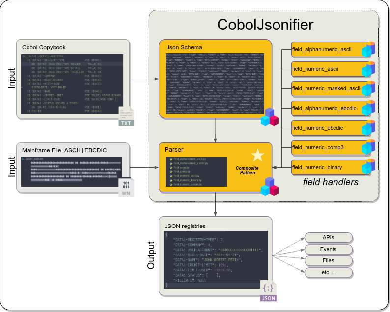

# Cobol Copybook JSONifier 🚀

[📜 CHANGELOG.md](https://github.com/jrperin/cobol-copybook.jsonifier/blob/master/CHANGELOG.md)

## ⚡ TL;DR 

``` bash
pip install coboljsonifier
pip install simplejson

# python code begin ---------- 8< ----------------------------------
# bookfname - The Cobol Schema filename
# data      - The Mainframe data filename
import simplejson
from coboljsonifier.copybookextractor import CopybookExtractor
from coboljsonifier.parser import Parser
from coboljsonifier.config.parser_type_enum import ParseType

dict_structure = CopybookExtractor(bookfname).dict_book_structure
parser = Parser(dict_structure, ParseType.BINARY_EBCDIC).build()
parser.parse(data)
dictvalue = parser.value
print(simplejson.dumps(dictvalue))
# python code end ------------ 8< ----------------------------------

# Than run you code:
python3 your_pgm_name
```

## 1️⃣ 📖 Introduction

The *COBOL Copybook JSONifier* is a powerful tool created to streamline the transformation of EBCDIC-encoded data files from mainframes into JSON format through COBOL copybook schemas. This process is essential for the efficient transfer and handling of mainframe data in cloud environments and other contemporary systems. 🌩️

## 2️⃣ 🤔 Why Choose COBOL Copybook JSONifier?

- ⚡ **Efficiency**: Automates parsing, saving time and effort by eliminating manual conversions.
- 🔄 **Versatility**: Compatible with a variety of data types such as binary, COMP3, and numeric fields.
- 🛠️ **Ease of Use**: Simple installation and user-friendly setup ensures quick deployment.
- ✅ **Reliability**: Utilizes COBOL copybooks for precise data conversion, reducing errors.
- 🤝 **Integration**: JSON output can be easily incorporated into modern applications for better data manipulation.

This package is particularly useful for organizations transitioning mainframe data to cloud-based solutions, enhancing data accessibility and interoperability. 🚀

## 3️⃣ 📂 What is this for?

This package is designed to:

  1. Parse mainframe files in EBCDIC format into JSON using COBOL copybook schemas.
  2. Simplify the transfer and processing of mainframe data in modern environments.

**What are Mainframe's "Raw Positional Files"?**

**Raw positional files** are structured files where each piece of data is located at a fixed position. Think of them as a **library card** with designated sections for specific information (e.g., name, due date).

## 4️⃣ 🛠️ Before Start 

1. **Extracting the COBOL Copybook Structure**: First, extract the cobol schema from the code and save it to a file like `my_schema.cob`.

2. **Get the data to process**:  Save the Mainframe's file to some local place. Something like `my_data.bin`.

3. **🚨 Data Transfer Considerations**:

   - ☢️ **Binary Data**: For data types like `BINARY`, `COMP`, `COMP3`, and signed numeric fields ( `S9(n)`), it is essential to transfer in binary mode to preserve the data's integrity. Transferring these in text mode will corrupt the data during the EBCDIC to ASCII conversion

   - ☢️ **Text Data**: Only fields defined with `PIC 9(n)`, `PIC X(n)`, and masked numeric fields (`PIC +99999.99`) can be safely transferred in text mode.

Correct transfer modes prevent data corruption, particularly with binary data types. ⚙️

## 5️⃣ 🌊 CobolJsonifier Data Flow

 COBOL Copybook ➕ Mainframe Data (EBCDIC) ➡️ Parser ➡️ JSON Output ➡️ Cloud Apps, APIs, etc.

 

## 6️⃣ 🚀 Usage

1. **Installing the Package**: 

    ```bash
    pip install coboljsonifier
    ```

    **📋 Note:**

      - To save in json formats is necessary to use <spam style="color:#009900">`simplejson`</spam> package. It's to keep compatibility of `Decimal` pakage that is used to handle monetary values.
      
      - The common `json` library has incompatibility with Decimal values
      
      - Install `simplejson` just running `pip install simplejson`.
      
      - Use `simplejson` the same way of `json`. 
        > Ex.   
        > `install simplejson as json`   
        > It will keep compatibility with the main functionalities.
        >

2. Using the Package:

    ``` python
    import simplejson
    from coboljsonifier.copybookextractor import CopybookExtractor
    from coboljsonifier.parser import Parser
    from coboljsonifier.config.parser_type_enum import ParseType

    dict_structure = CopybookExtractor(bookfname).dict_book_structure
    parser = Parser(dict_structure, ParseType.BINARY_EBCDIC).build()
    parser.parse(data)
    dictvalue = parser.value
    print(simplejson.dumps(dictvalue))
    ```

3. Testing: Check functionality with:
    ``` bash
    # Install coverage first
    python -m venv venv
    source venv/bin/activate
    pip install -r requirements

    # Running only the unittest
    python -m unittest discover

    # Checking test coveraging
    coverage run -m unittest discover
    coverage report -m
    coverage html
    ```

## 7️⃣ 📚 Appendix 

- Supported Data Types

``` text
=======================================================================================
    TYPES                             CLASSES                          EBCDIC  ASCII   
=======================================================================================
    -[Empty]-------------------------------------------------------------------------- 
    00  Empty Content                 Fieldempty                        yes✅  yes✅   
    -[Numeric Types without signal]--------------------------------------------------- 
    01) 9                             FieldSimpleNumeric                yes✅  yes✅   
    02) 9V99                          FieldSimpleNumericDecimals1       yes✅  yes✅   
    03) 9V9(2)                        FieldSimpleNumericDecimals2       yes✅  yes✅   
    04) 9(12)                         FieldSimpleNumeric1               yes✅  yes✅   
    05) 9(12)V99                      FieldSimpleNumeric1Decimals1      yes✅  yes✅   
    06) 9(12)V9(2)                    FieldSimpleNumeric1Decimals2      yes✅  yes✅   
    -[Numeric Types with signal]------------------------------------------------------ 
    07) S9(12)       [BINARY/COMP3]   FieldSignalNumeric1               yes✅  no ❌   
    08) S9(12)V99    [BINARY/COMP3]   FieldSignalNumeric1Decimals1      yes✅  no ❌   
    09) S9(12)V9(2)  [BINARY/COMP3]   FieldSignalNumeric1Decimals2      yes✅  no ❌   
    -[Masked Numeric Types]----------------------------------------------------------- 
    A1) +99999999999999.99            FieldNumericMasked1               no ❌  yes✅   
        -99999999999999.99                                                             
        +99999999999999                                                                
        +ZZZZZZZZZZZZZ9.99                                                             
        -ZZZZZZZZZZZZZ9.99           (Note: These are just                             
         ZZZZZZZZZZZZZZ.ZZ                         some examples)                      
         99999999999999999                                                             
    -[Alphabetic]--------------------------------------------------------------------- 
    10) A(12)                         FieldAlphabetic                   yes✅   yes✅  
    -[Alphanumeric]------------------------------------------------------------------- 
    11) X(12)                         FieldAlphanumeric                 yes✅   yes✅  
    -[Undefined]---------------------------------------------------------------------- 
    12) None of the above             FieldUndefined                    yes✅   yes✅  
=======================================================================================
```

## 🔗 References 

* [Python Packaging Projects](https://packaging.python.org/tutorials/packaging-projects/)

* [Where to put tests](http://pythonchb.github.io/PythonTopics/where_to_put_tests.html)

* [Python Modules](https://docs.python.org/3/tutorial/modules.html)

* [Absolute vs Relative python imports](https://realpython.com/absolute-vs-relative-python-imports/)

* [Python UnitTest](https://pythontesting.net/framework/specify-test-unittest-nosetests-pytest/)


